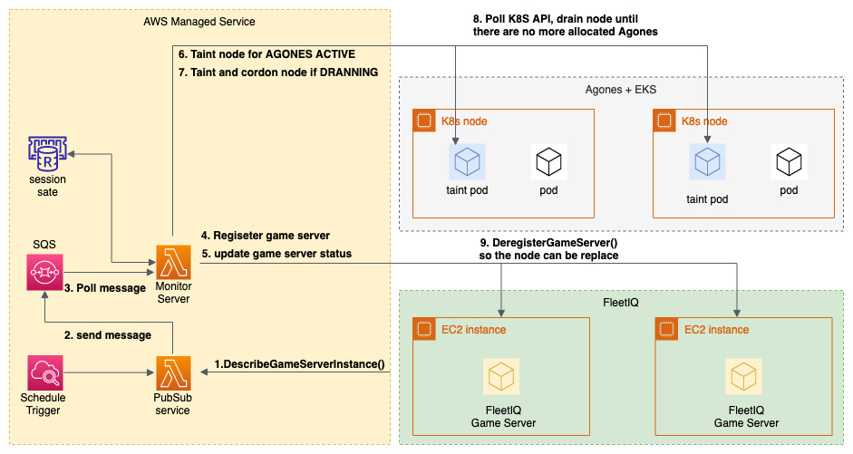
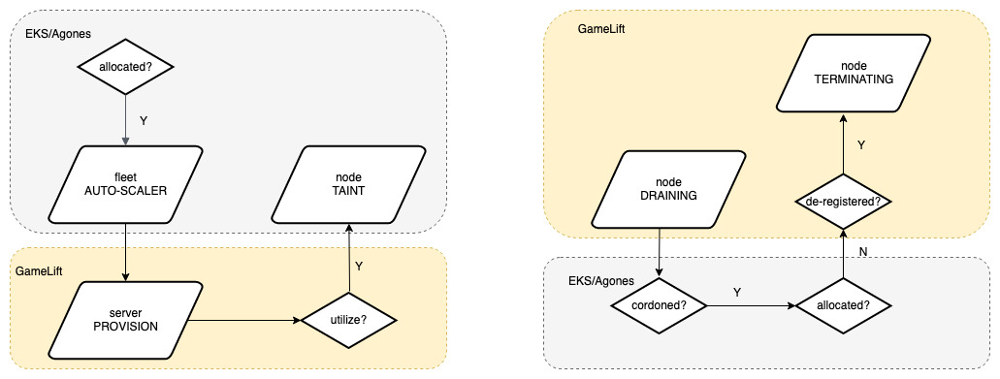
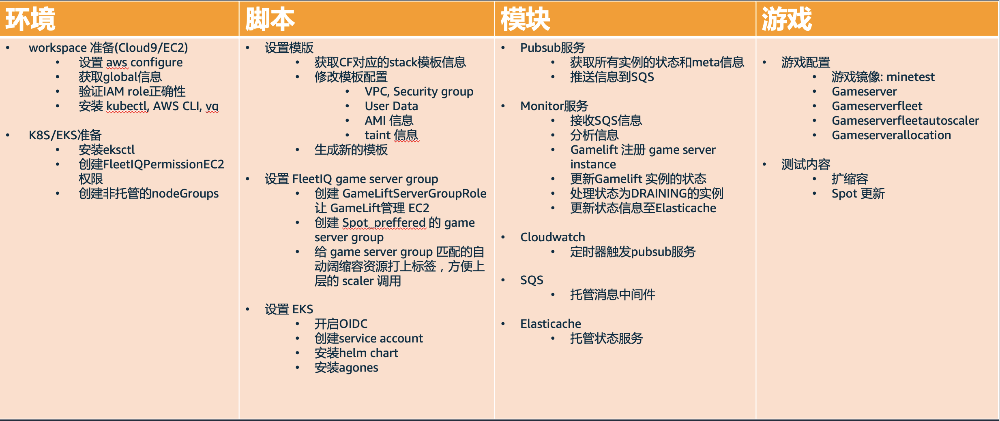
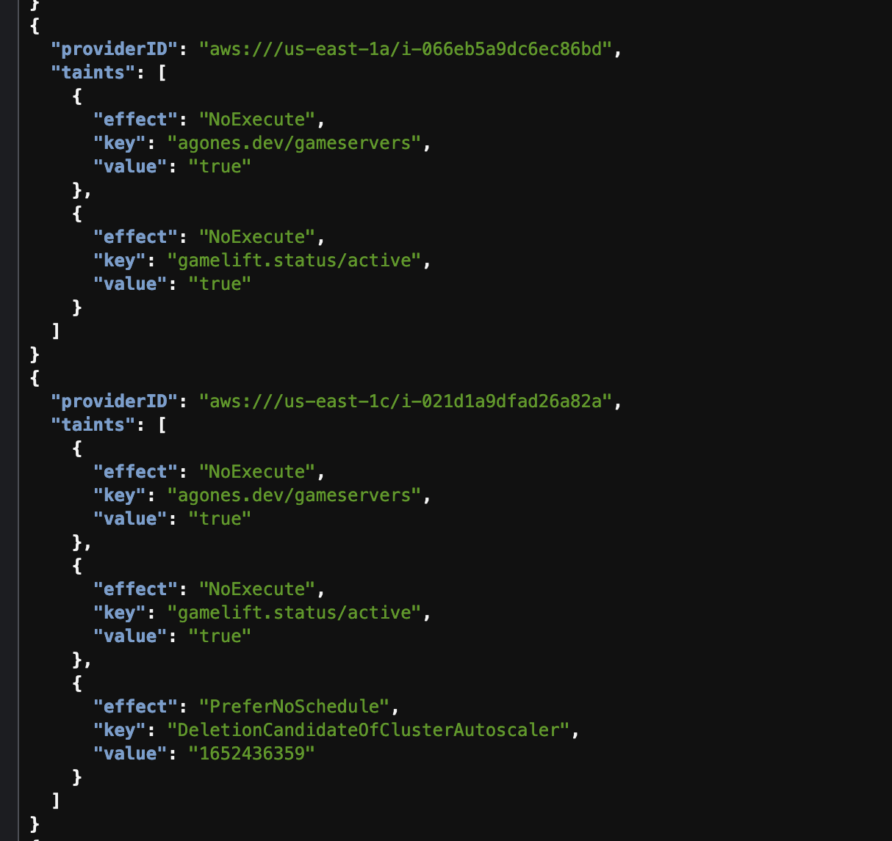
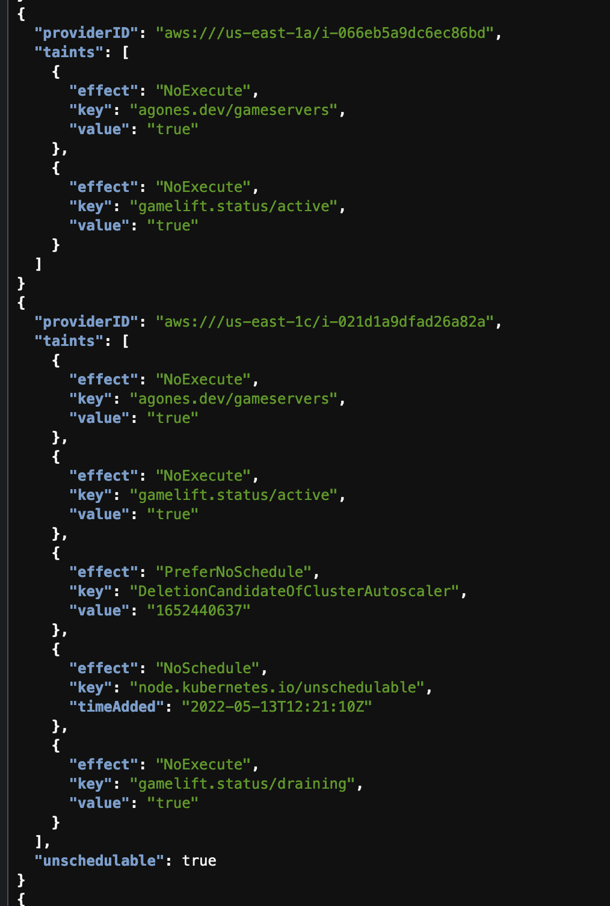

# fleetiq-agones-adaptor

## architecture 

## scale-out and scale-in 

## development guidance

## taint examples:

node tainted with **agones.dev/gameservers** is managed by agones

node tainted with **gamelift.status/active** is ready for agones allocation

node tainted with **gamelift.status/draining** is no suitbale for new sesssion

## reference

- [agones 官网](https://agones.dev/site/) 
- [k8s官网](https://kubernetes.io) 
- [EKSCTL文档](https://eksctl.io/) 
- [boto3 文档](https://boto3.amazonaws.com/v1/documentation/api/latest/index.html)  
- [gamelift文档](https://docs.aws.amazon.com/zh_cn/gamelift/index.html)  
- [Gamelift FleetIQ adapter文档](https://aws.amazon.com/blogs/gametech/introducing-the-gamelift-fleetiq-adapter-for-agones/)  
- [minetest 游戏](https://www.minetest.net/downloads/)  
- [Kubernetes python 客户端](https://github.com/Kubernetes-client/python)  
- [原项目github](https://github.com/awslabs/fleetiq-adapter-for-agones)  
- [agones测试项目](https://github.com/paulhkim80/agones-example-minetest)  
- [Kubernetes Cluster Auto-scaler](https://www.kubecost.com/kubernetes-autoscaling/kubernetes-cluster-autoscaler/)  
- [spot placement score](https://docs.aws.amazon.com/AWSEC2/latest/UserGuide/spot-placement-score.html)  
